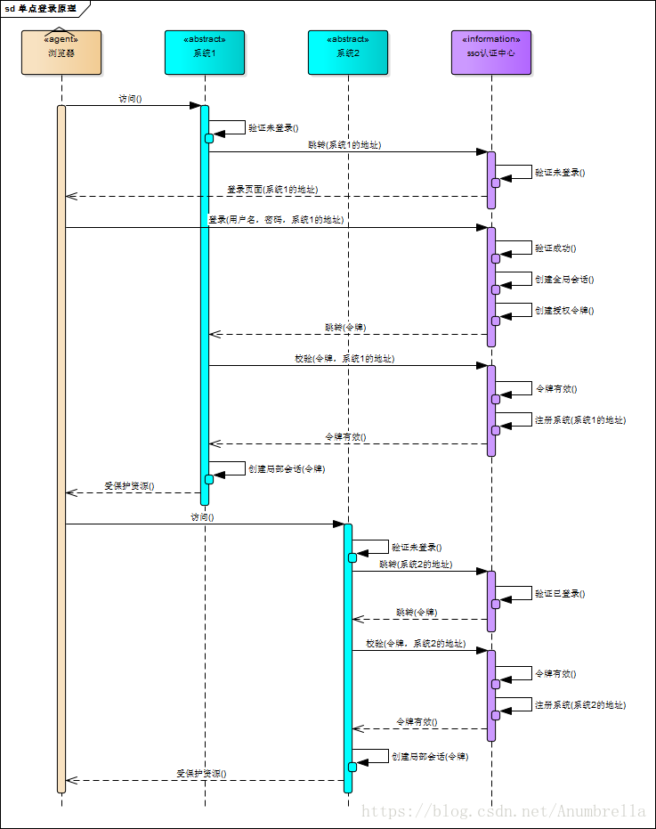
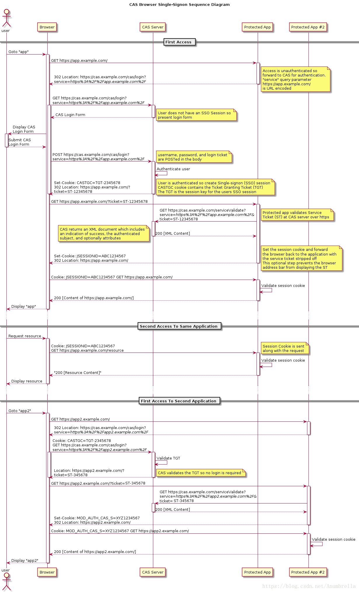

本文介绍一种使用oauth实现单点登录的方法。关于oauth和单点登录的介绍其他博客都写的很好，这里给出两篇参考文章，但不做详细介绍。

### OAuth系列博文推荐

 [认证 & 授权] 1. OAuth2授权  <https://www.cnblogs.com/linianhui/p/oauth2-authorization.html>

[[认证 & 授权\] 2. OAuth2授权（续） & JWT(JSON Web Token)](https://www.cnblogs.com/linianhui/p/oauth2-extensions-protocol-and-json-web-token.html)  <https://www.cnblogs.com/linianhui/p/oauth2-extensions-protocol-and-json-web-token.html>

 [认证 & 授权] 3. 基于OAuth2的认证（译） <https://www.cnblogs.com/linianhui/p/authentication-based-on-oauth2.html>

[认证 & 授权] 4. OIDC（OpenId Connect）身份认证（核心部分） <https://www.cnblogs.com/linianhui/p/openid-connect-core.html>

### 单点登录博文推荐

[CAS单点登录] https://blog.csdn.net/anumbrella/article/details/80821486

[CAS 介绍] https://www.cnblogs.com/xiatian0721/p/8136305.html

[CAS官方网站] https://apereo.github.io/cas/development/planning/Architecture.html

### 单点登录背景及原理

SSO的定义是在多个应用系统中，用户只需要登录一次就可以访问所有相互信任的应用系统。

举例：上豆瓣，要登录豆瓣FM、豆瓣读书、豆瓣电影、豆瓣日记，如果我们访问豆瓣读书、豆瓣电影、豆瓣日记都需要进行一次登录认证，那么用户体验是非常不好的。所以引用了单点登录。只要一次登录就可以访问所有相互信任的应用系统。



我们用上图来解释一下单点登录的原理。

假设有两个业务系统：系统1和系统2；一个sso认证中心；一个浏览器。

当用户通过浏览器访问业务系统1时，分为以下几个步骤：

- 系统1检测到未登录，会携系统1的地址跳转到认证中心；
- 认证中心检测当前为登录用户，则让浏览器重定向到用户登录页面；
- 用户输入账号密码登录
- 认证中心验证账号密码，若成功，则创建全局会话（通常会登录后生成的cookie、session等）和授权令牌，并携令牌跳回到业务系统1；
- 系统1写令牌到认证中心进行校验，若校验通过，创建局部会话（系统1的cookie和session等），并返回用户所访问的资源信息。

在系统1已经完成登录的情况下，此时若用户访问系统2，有如下步骤：

- 系统2检验未登录，携带系统2的地址跳转到认证中心；
- 认证中心检测到已登录，下发令牌并跳转到系统2；
- 系统2携带令牌到认证中心校验，若校验通过，创建局部会话，并返回用户所访问的资源信息。

一个更详细的在跳转过程中携带参数的流程示意图：



### 使用oauth实现sso

#### 1. 搭建认证中心

示例代码：

其中搭建方法和其中各参数的含义参见我的另一篇博客：<https://horizonliu.github.io/2020/05/06/spring-oauth%E6%BA%90%E7%A0%81%E9%98%85%E8%AF%BB%E5%8F%8A%E4%BD%BF%E7%94%A8%E5%85%B6%E5%AE%9E%E7%8E%B0%E6%8E%88%E6%9D%83/>

```java
@Configuration
@EnableAuthorizationServer
public class OAuth2AuthorizationServerConfig extends AuthorizationServerConfigurerAdapter {

    @Autowired
    private PasswordEncoder passwordEncoder;
    @Autowired
    private MongoClientDetailsService mongoClientDetailsService;
    @Autowired
    MongoTokenStore mongoTokenStore;
    @Autowired
    MongoAuthorizationCodeService mongoAuthorizationCodeService;

    @Autowired
    RoleUserApprovalHandler userApprovalHandler;
    
    @Autowired
    private MongoUserDetailsService mongoUserDetailsService;

    @Override
    public void configure(AuthorizationServerSecurityConfigurer security) throws Exception {
        security.allowFormAuthenticationForClients()
                .passwordEncoder(passwordEncoder)
                .checkTokenAccess("permitAll()");
//                .checkTokenAccess("isAuthenticated()");
    }

    @Override
    public void configure(ClientDetailsServiceConfigurer clients) throws Exception {
        clients.withClientDetails(mongoClientDetailsService);
    }

    @Override
    public void configure(AuthorizationServerEndpointsConfigurer endpoints) throws Exception {
        endpoints.tokenStore(mongoTokenStore)
                .authorizationCodeServices(mongoAuthorizationCodeService)
                .userApprovalHandler(userApprovalHandler)
                .authenticationManager(createPreAuthProvider())
                .userDetailsService(mongoUserDetailsService);
        endpoints.tokenServices(defaultTokenServices());
        super.configure(endpoints);
    }

    @Bean
    public DefaultTokenServices defaultTokenServices() {
        DefaultTokenServices defaultTokenServices = new DefaultTokenServices();
        defaultTokenServices.setTokenStore(mongoTokenStore);
        defaultTokenServices.setClientDetailsService(mongoClientDetailsService);
        // 避坑指南：https://www.cnblogs.com/luas/p/12118694.html
        // solution：https://stackoverflow.com/questions/34716636/no-authenticationprovider-found-on-refresh-token-spring-oauth2-java-config
        defaultTokenServices.setAuthenticationManager(createPreAuthProvider());
        defaultTokenServices.setSupportRefreshToken(true);
        defaultTokenServices.setReuseRefreshToken(true);
        return defaultTokenServices;
    }

    private ProviderManager createPreAuthProvider() {
        PreAuthenticatedAuthenticationProvider provider = new PreAuthenticatedAuthenticationProvider();
        provider.setPreAuthenticatedUserDetailsService(new UserDetailsByNameServiceWrapper<>(mongoUserDetailsService));
        return new ProviderManager(Arrays.asList(provider));
    }
}

```

#### 2. 子系统接入

##### 配置接口访问权限

```java
// 该注解开启单点登录
@EnableOAuth2Sso
@Configuration
public class WebSecurityConfig extends WebSecurityConfigurerAdapter {

    @Autowired
    private EnvironmentUtils environmentUtils;

    @Override
    public void configure(WebSecurity web) throws Exception {
        web.ignoring().antMatchers("/bootstrap/**");
    }

    @Override
    protected void configure(HttpSecurity http) throws Exception {
        if ("local".equals(environmentUtils.getActiveProfile())) {
            http.authorizeRequests().anyRequest().permitAll();
        }else {
            // 登出：先调用本地/logout，调用成功再调用认证中心的logout
            // 注意，这种登出方式会有问题：
            // 当有多个子系统时，必须要挨个退出各子系统才能实现所有子系统的退出
            // 可以理解为，子系统并不是每个请求都去认证中心校验了token
            // 而是会先利用局部会话中的session先本地校验，校验通过即可直接访问受保护资源
            http.logout().logoutSuccessUrl("http://localhost:18081/v1/account/logout/sso")
                    .and()
                	// 所有请求都需先认证才可访问
                    .authorizeRequests()
                    .anyRequest().authenticated()
                    .and()
                    .csrf().disable();
        }
    }
}
```

##### sso参数配置

```yml
security:
  oauth2:
  	# redirect_uri。调用认证中心/oauth/authorize接口时的回调地址
    sso:
      login-path: /login
    # clientId配置
    client:
      client-id: test #OrderManagement
      client-secret: test #order123
      access-token-uri: http://localhost:18081/oauth/token #获取token地址
      user-authorization-uri: http://localhost:18081/oauth/authorize # 授权地址
    resource:
      token-info-uri: http://localhost:18081/oauth/check_token  # 校验token地址
      user-info-uri: http://localhost:18081/oauth/resource/user  # 获取用户信息
      # 默认为true，表示先使用token-info-uri配置项；若设为false，表示先使用user-info-uri
      prefer-token-info: false
      # jwt相关配置 -- 本示例中未使用
      jwt:
        key-uri: xxx
        key-value: xxx
```

还有许多其他配置项，具体参考`ResourceServerProperties` 类，这里不再详细罗列。

#### oauth单点登录流程

- 用户访问子系统的接口/interface；
- 子系统检验用户未登录，重定向到/login 接口（配置中的sso.login-path)；
- /login接口携带参数重定向到认证中心http://localhost:18081/oauth/authorize 接口；
- 认证中心检验用户是否登录，若未登录，重定向到登录页面；
- 用户登录，登录成功，认证中心创建全局会话，重定回子系统的/login接口，并携带参数authorization_code模式生成的code；
- 子系统携带code访问http://localhost:18081/oauth/token 接口并获得token（令牌）；
- 子系统携带token调用http://localhost:18081/oauth/check_token 进行校验，校验通过可获取用户信息并创建局部会话（局部会话根据token生成）；
- 返回用户受保护资源信息。

#### 关于单点登出

单点登出，即一个应用登出，所有应用均需退出。

已oauth实现的单点登出来说，即要使认证中心颁发的全局token失效，所以只需要在本章第2节中`WebSecurityConfig` 中的`logoutSuccessUrl(认证中心实现，子系统调用）)`接口中失效token即可。但由于子系统并不是每个请求都会去认证中心校验，因此会存在子系统退出时差问题，举个例子：

假设子系统1、2都已经登录。此时子系统1执行退出登录操作，先清除局部会话，再调用认证中心的logout，全局会话失效；用户再次访问子系统2，子系统2局部会话未失效，仍然可访问子系统2受保护资源。

因此针对这种场景，若要实现单点登出，认证中心在全局会话失效时必须通知其目前接入的所有子系统，让各系统失效各自的局部会话。