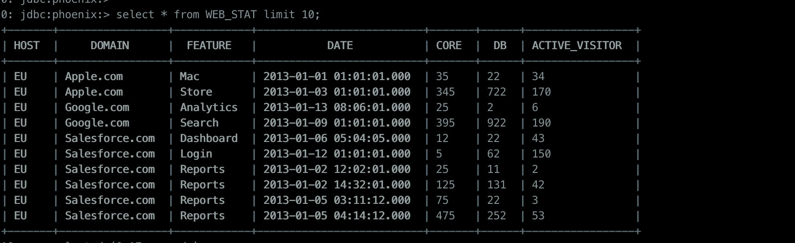

本文介绍一种使用springboot+jdbc连接phoenix并进行操作的方法。


### 添加依赖

```xml
		<!-- 由于线上环境的phoenix使用的是公司tbds（腾讯云大数据套件）的版本，所以这里特别选定对应的依赖 -->
		<dependency>
            <groupId>org.apache.phoenix</groupId>
            <artifactId>phoenix-core</artifactId>
            <!-- <version>4.8.1-HBase-1.2</version>-->
            <version>4.8.1-HBase-1.2-TBDS-4.0.4.1</version>
        </dependency>
		<!-- jdbc 依赖-->
		<dependency>
            <groupId>org.springframework.boot</groupId>
            <artifactId>spring-boot-starter-jdbc</artifactId>
        </dependency>
```

### 添加数据源配置

#### 方法一

##### 1. 编写配置类读取数据源

```java
package com.gac.cloud.iov.bigdata.service.config;

import lombok.extern.slf4j.Slf4j;
import org.springframework.beans.factory.annotation.Autowired;
import org.springframework.beans.factory.annotation.Qualifier;
import org.springframework.beans.factory.annotation.Value;
import org.springframework.boot.autoconfigure.jdbc.DataSourceBuilder;
import org.springframework.boot.context.properties.ConfigurationProperties;
import org.springframework.context.annotation.Bean;
import org.springframework.context.annotation.Configuration;
import org.springframework.context.annotation.Primary;
import org.springframework.jdbc.core.JdbcTemplate;
import org.springframework.jdbc.datasource.DriverManagerDataSource;

import javax.sql.DataSource;
import java.util.Properties;

/**
 * @author horizonliu
 * @date 2020/7/8 7:24 下午
 */
@Configuration
@Slf4j
public class PhoenixDataSource {

    @Value("${phoenix.url}")
    private String phoenixUrl;

    @Value("${phoenix.driver-class-name}")
    private String driverClassName;

    @Value("${phoenix.username}")
    private String username;

    @Value("${phoenix.password}")
    private String password;

    @Value("${phoenix.default-auto-commit}")
    private boolean autoCommit;

    @Bean(name = "phoenixJdbcTemplate")
    public JdbcTemplate phoenixJdbcTemplate(@Qualifier("phoenixDatasource") DataSource dataSource) {
        return new JdbcTemplate(dataSource);
    }


    @Bean(name = "phoenixDatasource")
    public DataSource phoenixDataSource() {
        // 注意，如果使用TBDS，且程序部署在TBDS集群外，需要加上hbase的鉴权参数，否则会认证失败
        Properties sysProperties = System.getProperties();
        sysProperties.setProperty("hbase_security_authentication_tbds_secureid", "xxx");
        sysProperties.setProperty("hbase_security_authentication_tbds_username", "hbase");
        sysProperties.setProperty("hbase_security_authentication_tbds_securekey", "xxx");
        System.setProperties(sysProperties);
        
        DriverManagerDataSource dataSource = new DriverManagerDataSource();
        Properties properties = new Properties();
        // 若hbase服务端开启了schema和namespace的映射关系，则需配置
        properties.setProperty("phoenix.schema.isNamespaceMappingEnabled", "true");
        dataSource.setConnectionProperties(properties);
        dataSource.setUrl(phoenixUrl);
        dataSource.setDriverClassName(driverClassName);
        dataSource.setUsername(username);
        dataSource.setPassword(password);
        return dataSource;
    }
}

```

##### 2. 在`application.yml`中添加配置

```yml
phoenix:
  enable: true
  #  url: jdbc:phoenix:localhost  # 连接配置
  driver-class-name: org.apache.phoenix.jdbc.PhoenixDriver
  username: ""  #phoenix的用户名默认为空
  password: ""  #phoenix的密码默认为空
  default-auto-commit: true
  # 如果使用tbds，需根据设置认证相关参数(secureid和secure_key)
  url: jdbc:phoenix:tbds-10-122-0-66,tbds-10-122-0-67,tbds-10-122-0-68:2181:/hbase-unsecure

```

#### 方法二

使用spring组件读取配置建立数据库连接，可配置多数据源。

##### 1. 编写配置类读取数据源

```java
package com.gac.cloud.iov.bigdata.service.config;

import lombok.extern.slf4j.Slf4j;
import org.springframework.beans.factory.annotation.Autowired;
import org.springframework.beans.factory.annotation.Qualifier;
import org.springframework.beans.factory.annotation.Value;
import org.springframework.boot.autoconfigure.jdbc.DataSourceBuilder;
import org.springframework.boot.context.properties.ConfigurationProperties;
import org.springframework.context.annotation.Bean;
import org.springframework.context.annotation.Configuration;
import org.springframework.context.annotation.Primary;
import org.springframework.jdbc.core.JdbcTemplate;
import org.springframework.jdbc.datasource.DriverManagerDataSource;

import javax.sql.DataSource;
import java.util.Properties;

/**
 * @author horizonliu
 * @date 2020/7/8 7:24 下午
 */
@Configuration
@Slf4j
public class PhoenixDataSource {
    
    @Bean(name = "phoenixDatasource")
    @ConfigurationProperties(prefix = "spring.phoenixDataSource")
    public DataSource phoenixDataSource() {
        return DataSourceBuilder.create().build();
    }

    @Bean(name = "phoenixJdbcTemplate")
    public JdbcTemplate phoenixJdbcTemplate(@Qualifier("phoenixDatasource") DataSource dataSource) {
        return new JdbcTemplate(dataSource);
    }

    @Bean
    @Primary
    @ConfigurationProperties(prefix = "spring.datasource")
    public DataSource primaryDataSource() {
        return DataSourceBuilder.create().build();
    }

    @Bean
    @Primary
    public JdbcTemplate jdbcTemplate(@Autowired DataSource dataSource) {
        return new JdbcTemplate(dataSource);
    }
}

```

##### 2.在`application.yml`中添加配置

```yml
spring:  
  datasource:
    url: jdbc:mysql://127.0.0.1:3306/behavior
    username: root
    password:
    driverClassName: com.mysql.jdbc.Driver
  phoenixDataSource:
    url: jdbc:phoenix:localhost
    driverClassName: org.apache.phoenix.jdbc.PhoenixDriver
    username: ""
    password: ""
    connection-properties: phoenix.schema.isNamespaceMappingEnabled=true
```

### 使用jdbcTemplate读数据

#### 1. WEB_STAT 表结构



#### 2. 读取

```java
	@Resource(name = "phoenixJdbcTemplate")
    private JdbcTemplate phoenixJdbcTemplate;

	@RequestMapping("/test")
    public CommonResponseBody test() {
        List<TestBean> res = phoenixTemplate.query("select * from WEB_STAT limit 10", (rs, i) -> {
            TestBean bean = new TestBean();
            bean.setHost(rs.getString("host"));
            bean.setCore(rs.getInt("core"));
            return bean;
        });
        return ResponseUtil.success(res);
    }
```

#### 3. JdbcTemplate使用

其他用法[参考spring官方文档](https://spring.io/projects/spring-data-jdbc#learn)

### 关于phoenix连接是否需要池化

```
No, it is not necessary to pool Phoenix JDBC Connections.

Phoenix’s Connection objects are different from most other JDBC Connections due to the underlying HBase connection. The Phoenix Connection object is designed to be a thin object that is inexpensive to create. If Phoenix Connections are reused, it is possible that the underlying HBase connection is not always left in a healthy state by the previous user. It is better to create new Phoenix Connections to ensure that you avoid any potential issues.

Implementing pooling for Phoenix could be done simply by creating a delegate Connection that instantiates a new Phoenix connection when retrieved from the pool and then closes the connection when returning it to the pool (see PHOENIX-2388).
```

[phoenix常用问题反馈](https://phoenix.apache.org/faq.html)

### 参考文档

[phoenix语法](https://phoenix.apache.org/language/index.html)

[datasource配置](https://howtodoinjava.com/spring-boot2/datasource-configuration/#configurations)

[修改连接配置](https://stackoverflow.com/questions/34856811/how-to-set-custom-connection-properties-on-datasource-in-spring-boot-1-3-x-with)

[phoenix使用注意事项](https://developer.aliyun.com/article/659441)

<https://developer.aliyun.com/article/319748>

