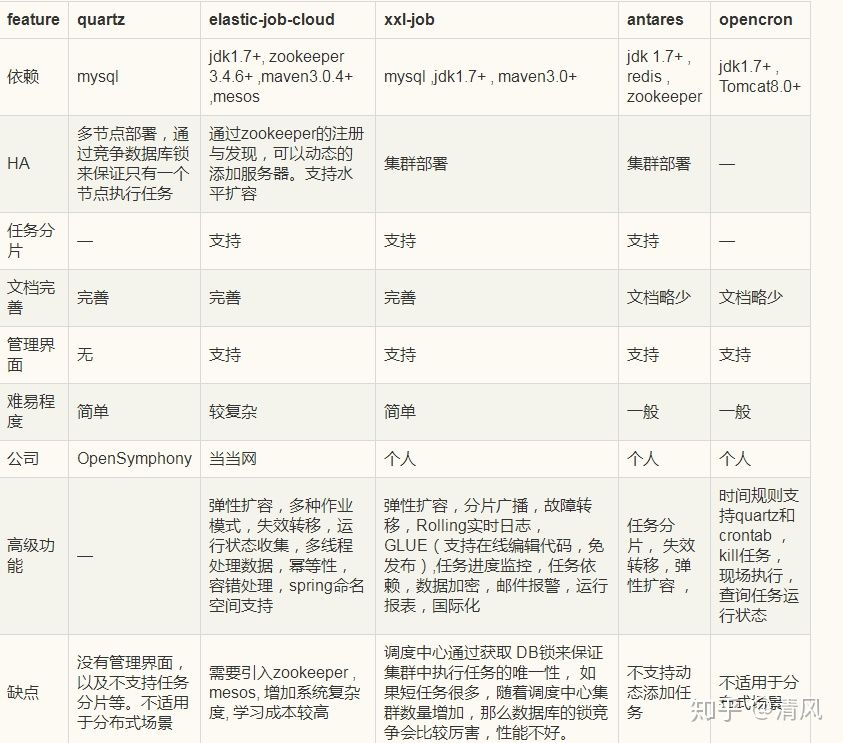

## 使用spring schedule+redis实现分布式定时任务

### 项目背景

因项目业务需求，需要定时的从第三方业务方增量同步数据(车型资讯数据：数据量不大，更新不频繁)。从现有的知识库中搜索，了解的有spring的schedule实现方式和quartz两种，那对于分布式定时任务，是不是有更好的实现方式呢，我进行了调研。

### 定时任务调研

[6大分布式定时任务对比 就这？？ 给你盘的明明白白](https://zhuanlan.zhihu.com/p/128601558)

- elastic-job
- xxl-job
- quartz
- saturn
- opencron
- antares

这6种实现方式中，quartz为基础实现组件，其他5种都是各公司或个人在quartz的基础上进行二次开发，引入了zk等组件优化实现，实践部署。各组件的对比图如下：



在本项目中，如果引入zk等组件，会使定时任务变得相对重量级，加上又是其他公司或个人开发的，其功能和稳定性不一定跟上，因此首先就排除了除quartz外的其他组件。因此接下来就是spring schedule和quartz的对比。

#### spring schedule

[spring @Schedule原理解析](https://juejin.cn/post/6844903924936212494)

1. spring schedule在多机器部署的情况下，无法保证一个任务只被执行一次（每个机器都会执行一次），需要联合数据库增加分布式锁来实现；
2. spring schedule的定时方式有三种：`fixedDelay`、`fixedRate` 和`cron`。
   - fixedDelay: 在上一个任务执行完成后，间隔一段时间后执行下一个任务；
   - fixedRate: 间隔指定时间长度(执行周期)执行一次任务，如果前一个任务执行时间（这个时间是累计的）超过执行周期，则后一个任务在前一个任务完成后立即执行，否则等待到指定周期时刻执行；
   - cron: 每隔一段时间(时间周期)就会来询问是否可以执行下一个任务，如果前一个任务没有执行完成，则后面的任务需要继续等待一个时间周期后再来问

#### quartz

quartz 的常见集群方案如下，通过在数据库(mysql)中配置定时器信息， 以数据库悲观锁的方式达到同一个任务始终只有一个节点在运行。

1. quartz保证节点高可用，若某个节点挂了，其他节点可以顶上；
2. 同一任务只能有一个节点运行，其他节点将不执行任务，性能低，资源浪费；
3. 当碰到大量短任务时，各个节点频繁的竞争数据库锁，接地那越多这种情况越严重，性能也会降低；
4. quartz的分布式仅解决了集群高可用的问题，并没有解决任务分片的问题，不能实现水平扩展。

#### spring schedule和quartz对比

若要实现分布式事务，都需要引入数据库锁来实现，quartz采用mysql数据库，而spring schedule可以选用轻量级的数据库(如redis)；两者只能使同一任务在一个节点运行，其他节点将不执行任务，资源浪费；遇到短任务时，锁的竞争也很频繁。

### 定时任务方案确定

由于本项目中，要做的只是增量同步第三方业务数据，且这个数据量不大，更新也不频繁，因此考虑使用更为轻量级的spring schedule + redis来实现(项目本身也使用了redis)。

### 分布式定时任务实现

采用spring schedule方式实现，需要先使用redis实现分布式锁，再使用spring schedule启动定时任务。

#### 使用redis实现分布式锁

[基于Redis的分布式锁实现](https://juejin.cn/post/6844903830442737671)

##### 添加redis依赖

```xml
        <!--REDIS-->
        <dependency>
            <groupId>org.springframework.boot</groupId>
            <artifactId>spring-boot-starter-data-redis</artifactId>
        </dependency>
        <dependency>
            <groupId>org.apache.commons</groupId>
            <artifactId>commons-pool2</artifactId>
        </dependency>
```

##### redis配置类

```java
@Configuration
public class RedisConfig {

    /**
     * redisTemplate 序列化使用的jdkSerializable, 存储二进制字节码, 所以自定义序列化类
     *
     * @param connectionFactory lettuce连接池
     */
    @Bean(name = "redisTemplate")
    public RedisTemplate<String, Object> redisTemplate(LettuceConnectionFactory connectionFactory) {
        RedisTemplate<String, Object> redisTemplate = new RedisTemplate<>();
        redisTemplate.setConnectionFactory(connectionFactory);

        // 使用Jackson2JsonRedisSerialize 替换默认序列化
        ObjectMapper objectMapper = new ObjectMapper();
        objectMapper.setVisibility(PropertyAccessor.ALL, JsonAutoDetect.Visibility.ANY);
        objectMapper.enableDefaultTyping(ObjectMapper.DefaultTyping.NON_FINAL);
        Jackson2JsonRedisSerializer<Object> jackson2JsonRedisSerializer = new Jackson2JsonRedisSerializer<Object>(Object.class);
        jackson2JsonRedisSerializer.setObjectMapper(objectMapper);

        RedisSerializer stringRedisSerializer = new StringRedisSerializer();

        // 设置key/value/hash_key/hash_value的序列化规则
        // redis数据使用方使用stringRedisSerializer方式进行序列化，修改需和使用方确认
        redisTemplate.setKeySerializer(stringRedisSerializer);
        redisTemplate.setValueSerializer(jackson2JsonRedisSerializer);
        redisTemplate.setHashKeySerializer(stringRedisSerializer);
        redisTemplate.setHashValueSerializer(stringRedisSerializer);

        redisTemplate.afterPropertiesSet();

        return redisTemplate;
    }
}
```

##### 实现分布式锁

```java
@Component
@Slf4j
public class RedisDistributeLock {

    @Autowired
    private RedisTemplate<String, Object> redisTemplate;


    /**
     * 获取分布式锁
     *
     * @param lockName   锁名-key
     * @param lockValue  锁值-value
     * @param expireTime 锁过期时间：防止锁未释放造成死锁
     * @param timeUnit   时间单位
     * @return true/false -- 成功/失败
     */
    public boolean tryLock(String lockName, String lockValue, long expireTime, TimeUnit timeUnit) {
        Boolean res = redisTemplate.opsForValue().setIfAbsent(lockName, lockValue, expireTime, timeUnit);
        log.info("try get lock:{} ,{}, res:{}", lockName, lockValue, res);
        return res != null && res;
    }

    /**
     * 获取分布式锁--使用lua脚本
     *
     * @param lockName   锁名-key
     * @param lockValue  锁值-value
     * @param expireTime 锁过期时间，单位秒：防止锁未释放造成死锁
     * @return true/false -- 成功/失败
     */
    public boolean tryLock(String lockName, String lockValue, long expireTime) {
        String setNxExpScript = "if redis.call('setnx',KEYS[1],ARGV[1]) == 1 "
                + " then redis.call('expire',KEYS[1],ARGV[2]) return 1 else return 0 end";
        List<String> keys = Arrays.asList(lockName);

        DefaultRedisScript<Long> script = new DefaultRedisScript<>();
        script.setResultType(Long.class);
        script.setScriptText(setNxExpScript);
        Long res = redisTemplate.execute(script, keys, lockValue, expireTime);
        return res != null && res == 1;
    }

    /**
     * 释放锁
     *
     * @param lockName  锁名-key
     * @param lockValue 锁值-value
     */
    public boolean releaseLock(String lockName, String lockValue) {
        String releaseScript = "if redis.call('get',KEYS[1]) == ARGV[1] "
                + " then return redis.call('del',KEYS[1]) else return 0 end";
        DefaultRedisScript<Long> script = new DefaultRedisScript<>();
        script.setResultType(Long.class);
        script.setScriptText(releaseScript);
        Long res = redisTemplate.execute(script, Arrays.asList(lockName), lockValue);
        log.info("release lock:{}, {}, result:{}", lockName, lockValue, res);
        return res != null && res >= 1;
    }

}
```

#### 使用分布式锁实现定时任务

```java
@Service
@Slf4j
public class SyncNewsTask {
    
    private static final String ASYNC_NEWS_TASK_LOCK = "async_news_task_lock";
    
	private static final long TEN_MINUTES = 10 * 60 * 1000;

    @Autowired
    private RedisDistributeLock redisDistributeLock;    

	@Scheduled(fixedRate = TEN_MINUTES)
    public void syncNews() {
        String uuid = UUID.randomUUID().toString();
        log.info("async news: {}, uuid:{}", ASYNC_NEWS_TASK_LOCK, uuid);

        try {
            // 获取锁
            boolean lock = redisDistributeLock.tryLock(ASYNC_NEWS_TASK_LOCK, uuid, TEN_MINUTES, TimeUnit.MINUTES);
            if (lock) {
                // 同步数据业务
                doSyncNews();
            } else {
                log.info("fail to get redis lock, wait next time");
            }

        } catch (Exception ex) {
            log.warn("async failure, ex:{}, {}", ex.getClass(), ex.getMessage());

        } finally {
            // 释放锁
            redisDistributeLock.releaseLock(ASYNC_NEWS_TASK_LOCK, uuid);
        }
    }
}
```

### 其他

考虑到增量同步业务数据的方式可能导致数据缺失，因此在业务实现的过程中采用了：

1. 同步失败的任务落库，进行二次同步；
2. 增量同步数据的同时，会定期同步一次全量数据。